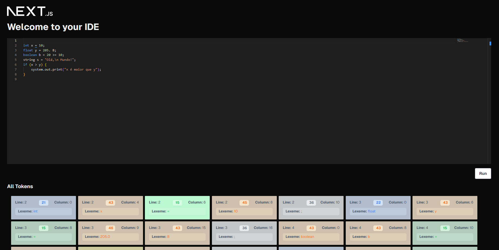

# Monorepo to manage the codebase of the IDE compiler

### A java -- compiler -- IDE

The compiler is a java compiler that compiles java code to byte code
The IDE is a text editor that allows you to write java code and compile it to byte code

Monaco IDE:

