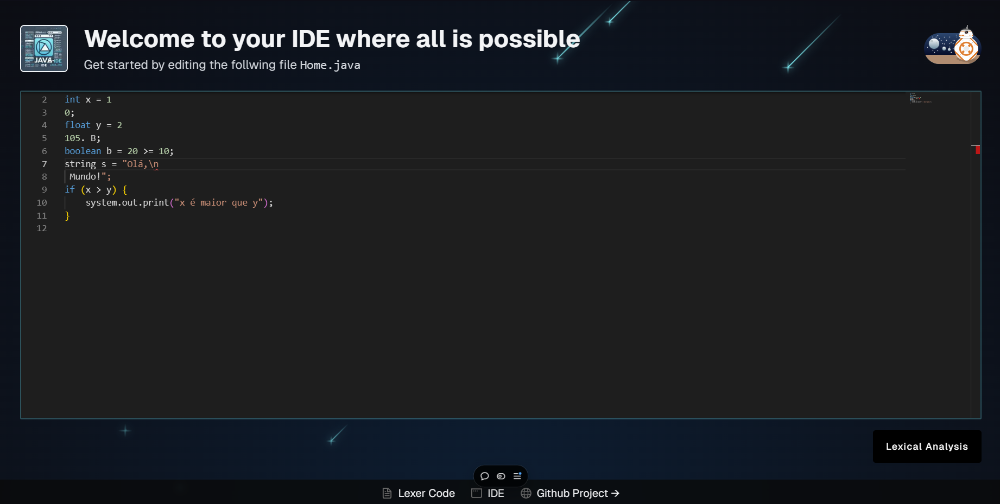
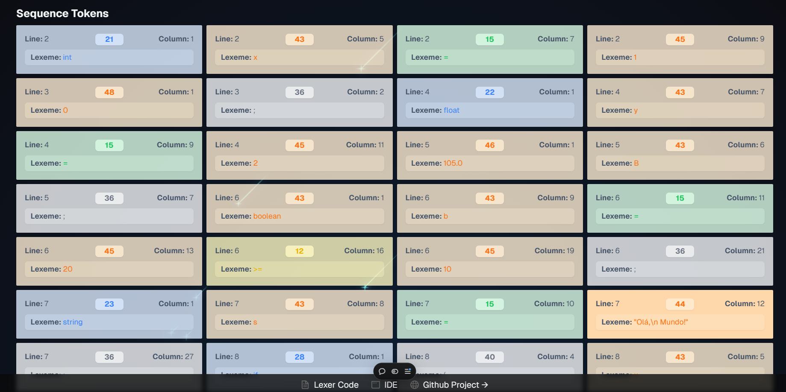

# Monorepo to manage the codebase of the IDE compiler

Scan tokens from java -- (simple version of java) character by character getting each token
The IDE is a text editor that allows you to write java code and compile it to byte code

<p align="center">
  <a href="#Instalation">Instalation</a>&nbsp;&nbsp; | <a href="#Instructions">Instructions</a>
</p>

Monaco IDE:



# Instalation

### IDE

```bash
cd packages/ide
npm install && npm run dev
```

### Compiler

```bash
cd packages/compiler
npm install && npm run start
```

Test the compiler with the following code:

```bash
cd packages/compiler
npm run test
```

# Instructions

Readmes for each package are in their respective folders:
[IDE](./packages/ide/README.md)
| [Compiler](./packages/compiler/README.md)

If you want to use the compiler start, you can edit the code by the file in: `packages/compiler/src/resource/input-code.java`

The main code is in the file `packages/compiler/src/index.ts`

[PDF Instruction](./packages/compiler/public/java--descriptionWork.pdf)

## Contributing

Feel free to contribute to the project, we are open to suggestions and improvements.
Even more so if it is for new test cases
