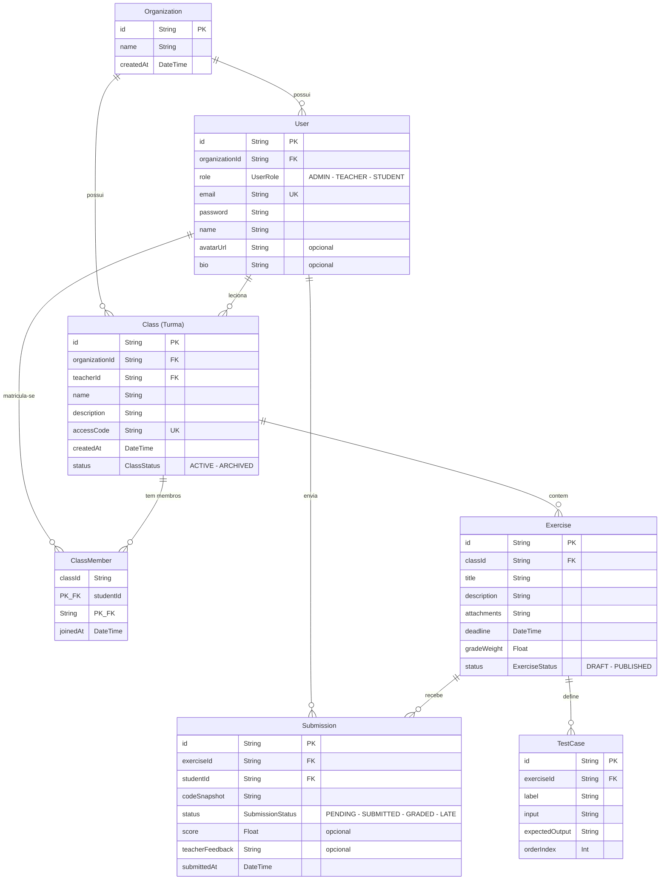

# Relacionamentos do Banco de Dados

## Diagrama ER (Mermaid)

> **Nota:** No diagrama abaixo, a tabela `Class` aparece como `Turma` porque `Class` é uma palavra reservada do Mermaid.

## Explicacao dos Relacionamentos

### Organization (Organizacao)

A **Organization** e a entidade raiz do sistema. Representa uma instituicao de ensino (escola, universidade, etc.).

- **Organization 1:N User** -- Uma organizacao possui muitos usuarios. Todo usuario pertence a exatamente uma organizacao (`organizationId`).
- **Organization 1:N Class** -- Uma organizacao possui muitas turmas. Toda turma pertence a exatamente uma organizacao (`organizationId`).

### User (Usuario)

O **User** representa qualquer pessoa no sistema. O campo `role` (enum: `ADMIN`, `TEACHER`, `STUDENT`) define o papel do usuario.

- **User 1:N Class** (relacao `TeacherToClass`) -- Um usuario com papel de professor pode lecionar em varias turmas. Cada turma tem exatamente um professor (`teacherId`).
- **User N:M Class** (via `ClassMember`) -- Um estudante pode estar matriculado em varias turmas, e uma turma pode ter varios estudantes. A tabela pivot `ClassMember` materializa essa relacao muitos-para-muitos, com chave primaria composta `(classId, studentId)` e o campo `joinedAt` registrando a data de ingresso.
- **User 1:N Submission** -- Um estudante pode ter muitas submissoes de exercicios. Cada submissao pertence a exatamente um estudante (`studentId`).

### Class (Turma)

A **Class** representa uma turma/disciplina no sistema.

- Pertence a uma **Organization** e a um **User** (professor).
- **Class 1:N Exercise** -- Uma turma possui muitos exercicios. Cada exercicio pertence a exatamente uma turma (`classId`).
- **Class 1:N ClassMember** -- Uma turma possui muitos membros (alunos matriculados).
- Possui um `accessCode` unico que permite aos alunos ingressarem na turma.
- O `status` (enum: `ACTIVE`, `ARCHIVED`) controla se a turma esta ativa ou arquivada.

### Exercise (Exercicio)

O **Exercise** representa uma atividade/tarefa atribuida a uma turma.

- **Exercise 1:N Submission** -- Um exercicio pode receber muitas submissoes de diferentes alunos. Cada submissao refere-se a exatamente um exercicio (`exerciseId`).
- **Exercise 1:N TestCase** -- Um exercicio pode ter muitos casos de teste para validacao automatica. Os test cases sao deletados em cascata (`onDelete: Cascade`) quando o exercicio e removido.
- O `status` (enum: `DRAFT`, `PUBLISHED`) controla a visibilidade do exercicio.

### Submission (Submissao)

A **Submission** e a interseccao entre **User** (estudante) e **Exercise**.

- Cada submissao armazena o `codeSnapshot` (codigo enviado), `score` (nota opcional), `teacherFeedback` (feedback opcional do professor) e `submittedAt` (data de envio).
- O `status` (enum: `PENDING`, `SUBMITTED`, `GRADED`, `LATE`) rastreia o ciclo de vida da submissao.

### TestCase (Caso de Teste)

O **TestCase** define entradas e saidas esperadas para validacao automatica de exercicios.

- Pertence a um **Exercise** com delete em cascata.
- Possui `input`, `expectedOutput`, `label` e `orderIndex` para ordenacao.

## Resumo das Cardinalidades

| Relacao                        | Tipo | FK / Pivot       |
|-------------------------------|------|------------------|
| Organization -> User          | 1:N  | `organizationId` |
| Organization -> Class         | 1:N  | `organizationId` |
| User (Teacher) -> Class       | 1:N  | `teacherId`      |
| User (Student) <-> Class      | N:M  | `ClassMember`    |
| User (Student) -> Submission  | 1:N  | `studentId`      |
| Class -> Exercise             | 1:N  | `classId`        |
| Exercise -> Submission        | 1:N  | `exerciseId`     |
| Exercise -> TestCase          | 1:N  | `exerciseId`     |
